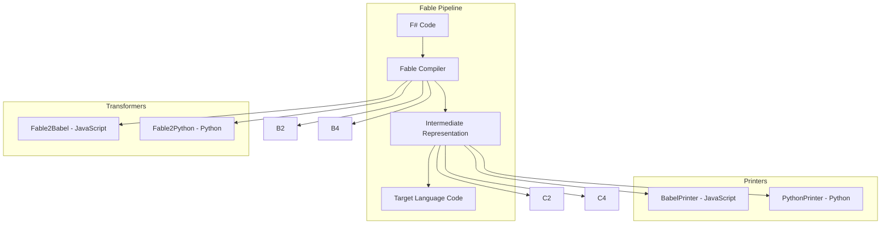

# Fable Architecture

## Table of Contents

- [Fable Architecture](#fable-architecture)
    - [Table of Contents](#table-of-contents)
    - [Building Blocks](#building-blocks)
    - [Components](#components)
        - [Transformer](#transformer)
        - [Printer](#printer)
        - [Pipeline](#pipeline)
        - [Project Cracker](#project-cracker)
        - [Library Components](#library-components)
    - [Language Implementations](#language-implementations)
        - [JavaScript Implementation](#javascript-implementation)
        - [Rust Implementation](#rust-implementation)
        - [Python Implementation](#python-implementation)

## Building Blocks

Fable is a compiler that translates F# code into various target languages such as JavaScript, Rust, Python, and more. The architecture of Fable consists of several main components:

- **F# Compiler**: This component, based on the F# Compiler Services (FCS), parses and type-checks the F# code, producing an abstract syntax tree (AST).
- **Fable Core**: The core library that provides the necessary runtime support for the translated code, including standard library functions and utilities.
- **Transformers**: Modules that transform the F# AST into an intermediate representation suitable for the target language. Each target language has its own transformer (e.g., `Fable2Babel` for JavaScript, `Fable2Rust` for Rust).
- **Printers**: Modules that take the intermediate representation and generate the target language code. Each target language has its own printer (e.g., `BabelPrinter` for JavaScript, `RustPrinter` for Rust).
- **Pipeline**: The orchestration layer that manages the transformation and printing processes, ensuring that the F# code is correctly compiled to the target language.
- **Project Cracker**: Responsible for parsing the F# project files and extracting the necessary information for the compilation process.
- **Plugins**: Extensions that add functionality to Fable, allowing it to support additional features or target languages.
- **Emit**: The component responsible for generating the target language code from the F# AST.

## Components

### Transformer

The Transformer is responsible for converting the F# `Abstract Syntax Tree` (AST) into an intermediate representation `IR` suitable for the target language.

- **JavaScript**: [Fable2Babel.fs](src/Fable.Transforms/Fable2Babel.fs)
- **Rust**: [Fable2Rust.fs](src/Fable.Transforms/Rust/Fable2Rust.fs)
- **Python**: [Fable2Python.fs](src/Fable.Transforms/Python/Fable2Python.fs)

### Printer

The Printer takes the intermediate representation and generates the target language code.

- **JavaScript**: [BabelPrinter.fs](src/Fable.Transforms/BabelPrinter.fs)
- **Rust**: [RustPrinter.fs](src/Fable.Transforms/Rust/RustPrinter.fs)
- **Python**: [PythonPrinter.fs](src/Fable.Transforms/Python/PythonPrinter.fs)

### Pipeline

The Pipeline orchestrates the transformation and printing processes, ensuring that the F# code is correctly compiled to the target language: [Main.fs](src/fable-standalone/src/Main.fs)

### Project Cracker

The Project Cracker is responsible for parsing the F# project files and extracting the necessary information for the compilation process: [ProjectCracker.fs](src/Fable.Compiler/ProjectCracker.fs)

### Library Components

For more information on the library components and how different F# namespaces are implemented for other languages, please refer to the [Library Components Documentation](LIBRARY_COMPONENTS.md).

## Language Implementations

Fable supports multiple target languages, each with its own implementation for .NET types. These implementations are crucial for providing the necessary runtime support and ensuring that F# code can be correctly translated and executed in the target language environment.

### JavaScript Implementation

- **Folder**: `src/fable-compiler-js`
- **Description**: Contains the implementation for translating F# code to JavaScript. This includes the core library (`fable-library-js`) that provides JavaScript equivalents for .NET types and functions.
- **Interplay**: The JavaScript implementation is used when the target language is set to JavaScript. It includes both the transformer (`Fable2Babel`) and the printer (`BabelPrinter`).

### Rust Implementation

- **Folder**: `src/fable-library-rust`
- **Description**: Contains the implementation for translating F# code to Rust. This includes the core library (`fable-library-rust`) that provides Rust equivalents for .NET types and functions.
- **Interplay**: The Rust implementation is used when the target language is set to Rust. It includes both the transformer (`Fable2Rust`) and the printer (`RustPrinter`).

### Python Implementation

- **Folder**: `src/fable-library-py`
- **Description**: Contains the implementation for translating F# code to Python. This includes the core library (`fable-library-py`) that provides Python equivalents for .NET types and functions.
- **Interplay**: The Python implementation is used when the target language is set to Python. It includes both the transformer (`Fable2Python`) and the printer (`PythonPrinter`).
